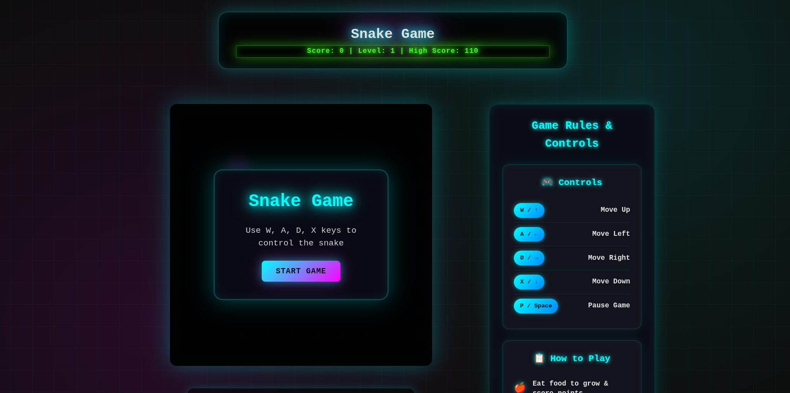
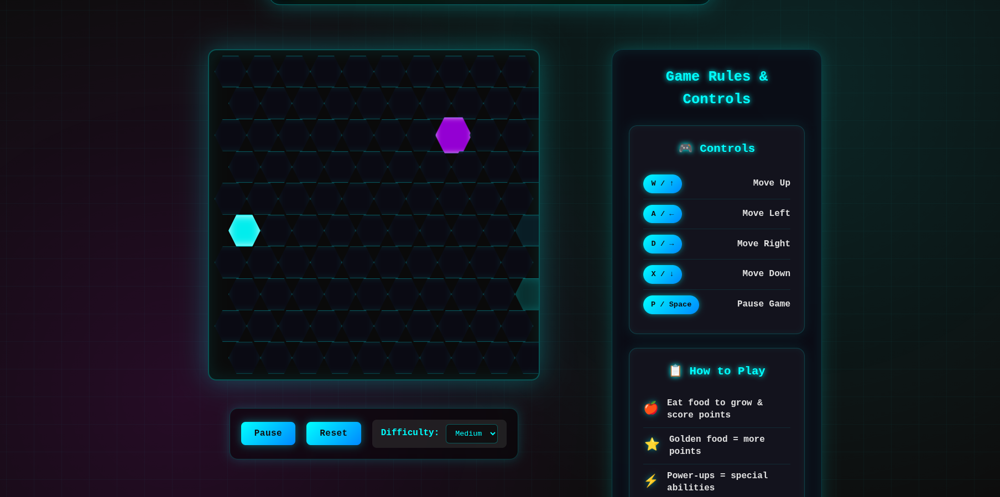
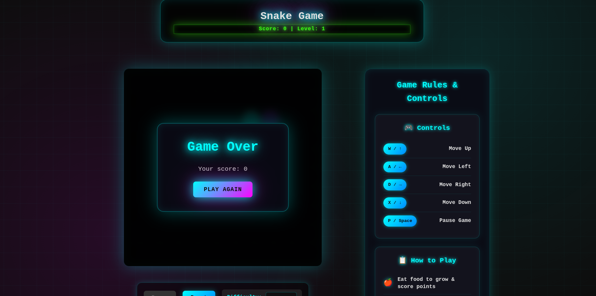

# 🐍 Snake Game - Hexagon Grid

A modern twist on the classic Snake game featuring a hexagonal grid, cyberpunk aesthetics, and advanced gameplay mechanics. Built with TypeScript and CSS animations.

 

## 🎮 Live Demo

[](https://ktabassum1809.github.io/hexagon-snake-game/)

**➡️ [Click here to play the game](https://ktabassum1809.github.io/hexagon-snake-game/) ⬅️**

## 📖 Repository

[](https://github.com/ktabassum1809/hexagon-snake-game)

**Clone the repository:**
```bash
git clone https://github.com/ktabassum1809/hexagon-snake-game.git
```
## ✨ Features

## 🎯 Core Gameplay
* **Hexagonal Grid**: Unique honeycomb layout instead of traditional squares
* **Multiple Food Types**:
  * 🍎 Normal Food (+10 points)
  * ⭐ Golden Food (+50 points, +3 growth)
  * 💀 Poison Food (-20 points, -2 segments)
  * ⚡ Power-ups (Special abilities)

## 🚀 Advanced Mechanics
* **Power-up System**:
  * 🛡️ Invincibility: Temporary collision immunity
  * 🐌 Slow Motion: Reduced game speed
* **Progressive Difficulty**: Speed increases with each level
* **Dynamic Scoring**: Combo system and high score tracking

## 🎨 Visual Experience
* **Cyberpunk Theme**: Neon glow effects and futuristic design
* **Smooth Animations**: Particle effects and transition animations
* **Responsive Design**: Works seamlessly on desktop and mobile
* **Matrix-inspired Background**: Animated grid overlay

## ⚙️ Technical Features
* **TypeScript Implementation**: Type-safe game logic
* **Local Storage**: Persistent high score saving
* **Touch Controls**: Mobile-optimized interface
* **Keyboard & Mouse Support**: Multiple input methods

## 🛠️ Tech Stack
* **Frontend**: HTML5, CSS3, TypeScript
* **Styling**: CSS Grid, Flexbox, Custom Animations
* **Architecture**: Modular Game Loop, Event-Driven Architecture
* **Storage**: Browser LocalStorage API

## 🎯 Controls
* **Desktop**
  * W/A/D/X or Arrow Keys: Movement
  * P or Spacebar: Pause/Resume
* **Mobile**
  * On-screen D-pad: Touch controls
  * Pause Button: Game controls


## 🚀 Quick Start

### Option 1: Live Demo (Recommended)
Play the game instantly — No installation required!  
👉 [Play the Game](https://ktabassum1809.github.io/hexagon-snake-game/)

### Option 2: Local Development
* Clone the repository
  ```bash
  git clone https://github.com/ktabassum1809/hexagon-snake-game.git
  cd hexagon-snake-game
  ```  
* Serve the files (any static server)
```bash
* # Using Python
python -m http.server 8000

# Using Node.js
npx serve .

# Using PHP
php -S localhost:8000
``` 
# 🎮 Game Rules
* **Objective**: Grow your snake by eating food while avoiding collisions
* **Scoring**:
  * 🍎 Normal Food: +10 points
  * ⭐ Golden Food: +50 points
  * 💀 Poison Food: -20 points
* **Level Progression**: Game speed increases every 50 points
* **Game Over**: Colliding with yourself (unless invincible)
* **Power-ups**: Temporary abilities that last 8 seconds

# 🔧 Development
* **TypeScript Compilation**
  * The game uses TypeScript for type safety. To modify the code:
    * Install TypeScript  
      ```bash
      npm install -g typescript
      ```
    * Compile to JavaScript  
      ```bash
      tsc script.ts
      ```
## 📸 Screenshots
<p align="center">
  
  
</p>

<p align="center">Built with 💻 and 🎮 by <a href="https://github.com/ktabassum1809">K Tabassum</a></p>

